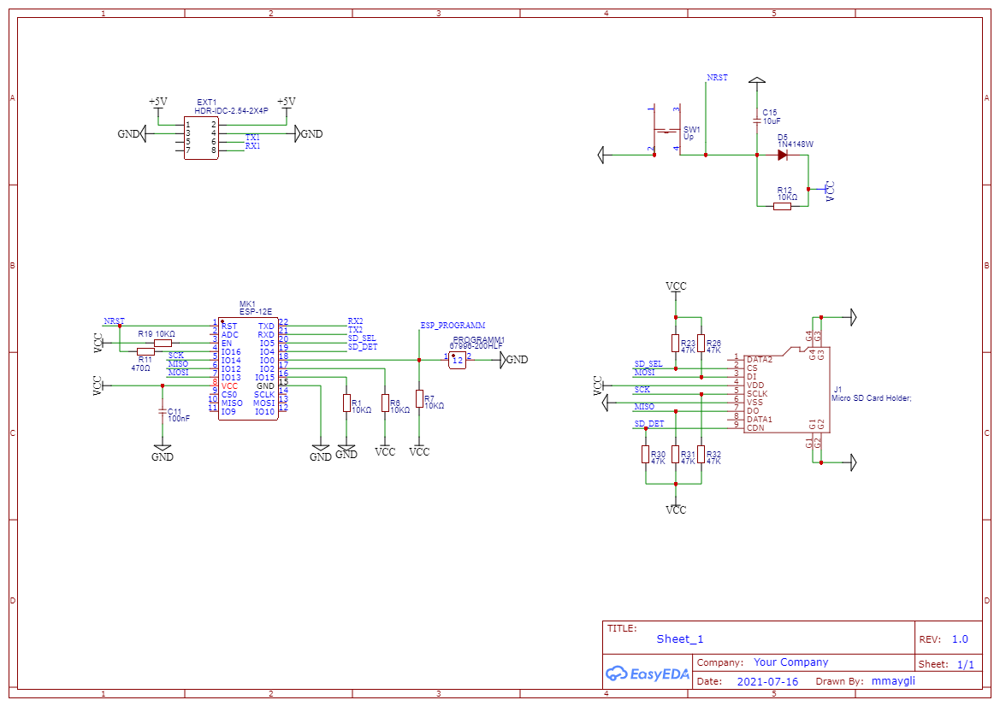

# ESP-GRBL-Controller
-----------------------

GRBL controller based on esp32.

 Hardware
-------------

 
 
 Code 
------------- 
Folders:
--------
**data** - contains web application

**debug** - tools for debugging.

  * **nodejs.server** contains debug server. To start server run NodeJs command line. Then go to nodejs.server folder and start command node *node grbldbgserver.js*

**docs** contains WebAPI.yaml file which is OpenAPI file. Subfolder **html** contains MantaGRBL WebAPI description in html form 

**esp-32** controller source code

**scripts** helper scripts
  * **convert_to_c.py** script to convert html into correct C string
